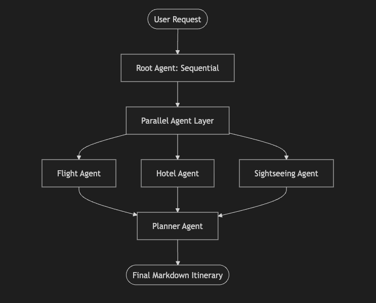

# Trip Planner Agent

This is a multi-agent trip planning application built using the [Google Agent Development Kit (ADK)](https://github.com/google/adk). It uses a parallel-to-sequential agent architecture to gather flight options, hotel accommodations, and sightseeing recommendations concurrently, then synthesizes them into a cohesive Markdown itinerary.

## Design Architecture

The application follows a modular and hierarchical design:



1.  **Orchestration**: A `SequentialAgent` (Root) manages the high-level flow.
2.  **Parallel Research**: A `ParallelAgent` triggers the Flight, Hotel, and Sightseeing agents simultaneously to reduce turnaround time.
3.  **Synthesis**: The final `Agent` (Planner) takes the JSON outputs from the research layer and crafts a user-friendly Markdown itinerary.

## Agent Roles

| Agent | Responsibility | Output Format |
| :--- | :--- | :--- |
| **Flight Agent** | Researches flight routes, durations, and pricing. | Structured JSON |
| **Hotel Agent** | Identifies top-rated accommodations and amenities. | Structured JSON |
| **Sightseeing Agent** | Recommends local attractions and dining spots. | Structured JSON |
| **Planner Agent** | Synthesizes research into a beautiful Markdown guide. | Markdown |

## Prerequisites

1. **Python 3.11+** installed on your system.
2. **Ollama** installed locally. You can download and install it from [ollama.com](https://ollama.com).

## Setup Instructions

### 1. Authenticate with Ollama Cloud
Since this application uses cloud-hosted Ollama models (specifically `qwen3.5:cloud`), you need to authenticate your local Ollama CLI with Ollama Cloud.

Run the following command in your terminal and follow the prompt instructions to sign in:
```bash
ollama signin
```
*(For more information about Ollama Cloud, see the [official documentation](https://docs.ollama.com/cloud))*

### 2. Create a Python Virtual Environment
It is highly recommended to run this project inside an isolated virtual environment to prevent dependency conflicts.

```bash
# Create the virtual environment
python -m venv .env

# Activate it (Mac/Linux)
source .env/bin/activate

# Activate it (Windows)
.env\Scripts\activate
```

### 3. Install Dependencies
With your virtual environment activated, install the required packages:

```bash
pip install -r requirements.txt
```

### 4. Run the Application
Start the ADK development web server by running the following command from the project root:

```bash
adk web
```

Once the server starts, open the URL displayed in your terminal (normally [http://127.0.0.1:8000](http://127.0.0.1:8000)) in your web browser. From the UI, you can send prompts directly to the trip planner agent.

## Sample Prompts & Results

For detailed examples of how to interact with the agent and see the types of itineraries it generates, please refer to the [Sample Inputs and Outputs](Sample_inputs_and_outputs.md) file.
